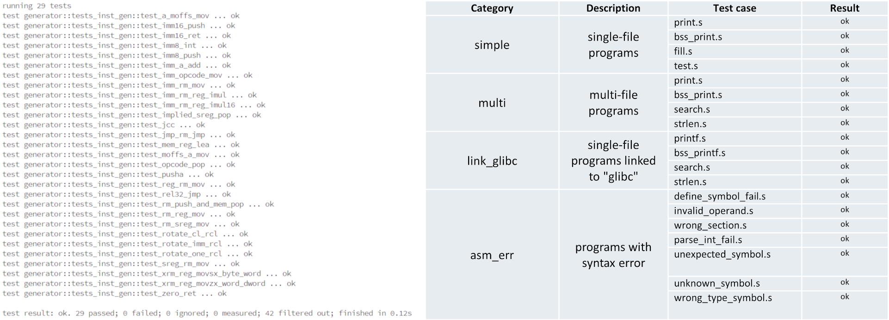
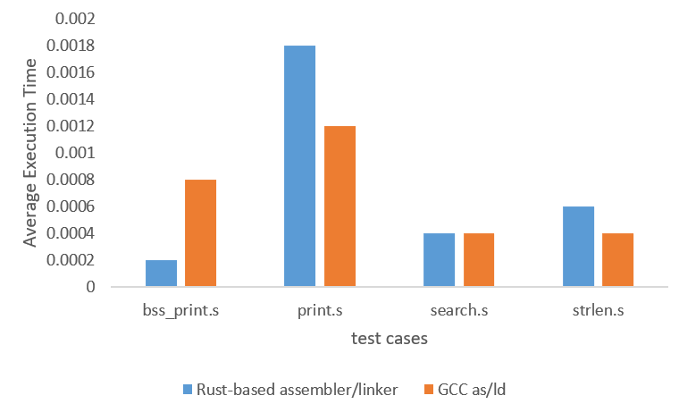

# The Design and Implementation of An Assembler and Linker for Teaching and Experiments.

The repository is the official implementation of [The Design and Implementation of An Assembler and Linker for Teaching and Experiments](https://ieeexplore.ieee.org/document/10484260). The paper presents the design and implementation of an assembler and linker on the x86 Linux platform for teaching experiments in computer architecture and program design. The assembler uses AT&T syntax and the linker can perform static linking of several target files. The assembler supports 158 different instructions, or a total of 398 different instructions if taking the differences of operand format into account. 

## Requirements

Install Rust:

```sh
curl --proto '=https' --tlsv1.2 -sSf https://sh.rustup.rs | sh
```

## Usage

1. Build the assembler and linker:
   ```sh
   cargo build
   ```
2. Then add `./target/debug/assembler` and `./target/debug/linker` to `PATH`.
3. The input parameters to the assembler take the following format:
   ```sh
   assembler -o <output-file> <input-file>
   ```
4. The input parameters to the linker take the following format:
   ```sh
   linker -o <output-file> <input-file1> <input-file2> ...
   ```

## Results

Correctness of instruction generation, and correctness of the executable file are verified.



Our generated executable files have similar execution times to those generated by GCC as/ld.



## References

If you find this repository helpful in your research, please consider citing:

```txt
@INPROCEEDINGS{10484260,
  author={Cao, Yifan and Xu, Wei},
  booktitle={2023 International Conference on Algorithms, Computing and Data Processing (ACDP)}, 
  title={Design and Implementation of An Assembler and Linker for Teaching and Experiments}, 
  year={2023},
  volume={},
  number={},
  pages={74-79},
  keywords={Ground penetrating radar;Source coding;Linux;Heuristic algorithms;Education;Geophysical measurement techniques;Computer architecture;assembler;linker;teaching experiment;Rust;ELF;x86},
  doi={10.1109/ACDP59959.2023.00019}}
```
